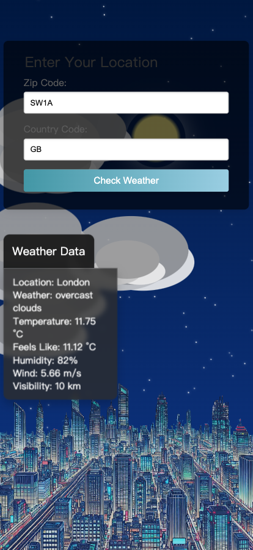

# Weather App 🌤️

This Weather App is a Node.js and Express-based web application that allows users to enter their location (ZIP code and country code) to fetch and display real-time weather information using the OpenWeatherMap API. The app visually represents weather conditions through effects like rain, sun, clouds, and nighttime views, making the experience more interactive and engaging.


## Preview




## Features

- **Location-based Weather**: Users can input their ZIP code and country code to get specific weather details for their area.
- **Real-time Weather Data**: Uses the OpenWeatherMap API to retrieve and display current temperature, humidity, visibility, wind speed, and weather conditions.
- **Visual Weather Effects**: Adds dynamic effects like rain, sunshine, clouds, or nighttime depending on the weather conditions.
- **Responsive and Interactive Design**: Designed to be visually appealing with smooth transitions and intuitive UI elements.

## Project Structure

- **Frontend**:
  - `index.html`: Main HTML file for the frontend structure.
  - `style.css`: Contains styling for forms, backgrounds, and weather effects (e.g., rain, sun, clouds, and night themes).
  - `handler.js`: Handles frontend interactions, submits form data, and applies visual effects based on the weather data.

- **Backend**:
  - `server.js`: Node.js Express server that handles the `/submitWeather` route, fetches location and weather data from OpenWeatherMap, and returns the results.
  - `handler.js`: Contains JavaScript functions to create weather effects and display real-time weather information based on user input.

## Installation

1. **Clone the repository**:
   ```bash
   git clone https://github.com/your-username/weather-app.git
   ```
2.	**Navigate to the project directory**:
```
cd weather-app
```

3.	**Install dependencies**:
```
npm install
```

4.	**Run the server**:
```
node server.js
```

5.	**Access the app**:

Open your browser and navigate to http://localhost:3000.

## Usage

	1.	Enter your ZIP code and country code in the form.
	2.	Submit the form to fetch weather data for the specified location.
	3.	View real-time weather details, including temperature, humidity, wind speed, and visibility.
	4.	The app will display appropriate visual effects based on the weather, enhancing the user experience.

## Dependencies

	•	Express: Web framework for handling routes.
	•	Axios: HTTP client for fetching data from the OpenWeatherMap API.
	•	Cors: Middleware to allow cross-origin requests.
	•	OpenWeatherMap API: Provides weather and geolocation data.

## Environment Setup

	•	Replace the apiKey in server.js with your OpenWeatherMap API key.

## Future Enhancements

	•	Additional Weather Effects: Add more visual effects like snow, fog, and thunderstorms.
	•	User Settings: Allow users to toggle effects on and off.
	•	Multi-language Support: Provide support for different languages.
	•	Error Handling Improvements: Display more informative error messages for invalid inputs or network issues.

## License

This project is open-source and available under the MIT License.
